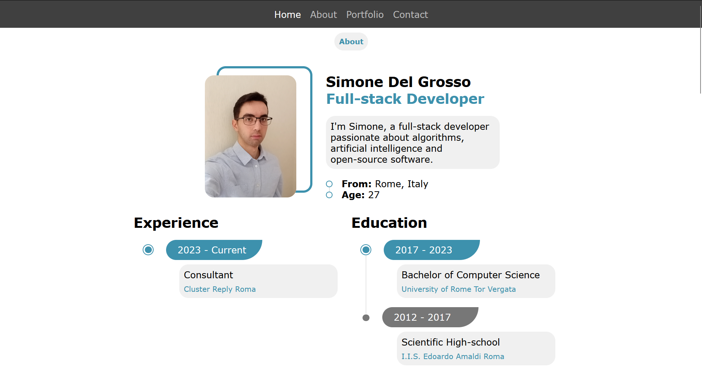

# Portfolio

This is the repository of my personal portfolio website, available at:  
**[https://simdlg.github.io](https://simdlg.github.io)**

## ✨ Features

- **Multi-language**: supports both Italian and English using YAML files.
- **Automatic redirect**: detects browser language and redirects to the correct version.
- **Responsive design**: optimized layout for both mobile and desktop.
- **SEO-friendly**: clean structure, custom meta tags, favicon, and sitemap.
- **Static site**: built with HTML, CSS, JavaScript, and [Jekyll](https://jekyllrb.com/).

## 🛠️ Technologies

- **Jekyll** – static site generator
- **HTML5, CSS3, JavaScript** – for layout and interactivity
- **GitHub Pages** – for free hosting and continuous deployment

## 📷 Screenshots

  

